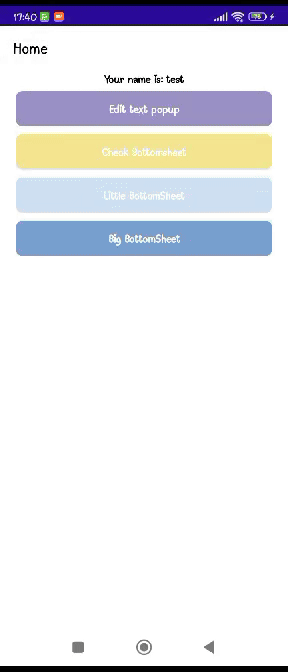

# BottomSheetMaui
A simple BottomSheet i made.

Inspired by:

https://github.com/pabloprogramador

Thanks daddy!


Here is my NuGet:

[](https://www.nuget.org/packages/BottomSheetMaui/1.0.0)


## How to use
```csharp
//Open BottomSheet
await BottomSheet.Open(new BottomSheetExample());
//Open Popup
await Popup.Open(new PopExample());
```

## More options
```csharp
IsFadeBackground = false;
```



